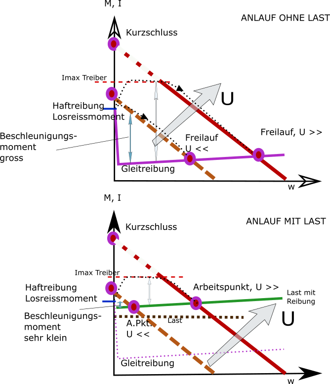
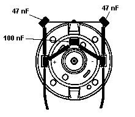
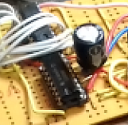
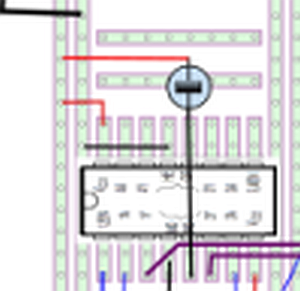

# Motorfunktion DC Motor mit Permanentmagnet Stator:

## Strom bestimmt Moment

+ der Strom im Rotor erzeugt ein Drehmoment durch die Lorentzkraft auf die Elektronen, die der Strom durch das Magnetfeld bewegt.
+ Der Commutator polt den Strom immer im richtigen Moment so um, dass 
das Drehmoment die Richtung beibehält. Dazu sind auf dem Rotor unterschiedliche Wicklungen mit Segmenten auf einem Schleifring verbunden, der von Bürsten oder Kohlen mit der Stromversorgung (Treiber) verbunden wird.

## was bestimmt den Strom?  -- elektrisches Verhalten

### Motor dreht noch nicht oder wird abgestoppt:

+ Motor ist eine DC Schaltung, im Prinzip ein Kurzschluss, der Strom 
ergibt sich aus I = U/R,  R ein paar Ohm,
wobei aber U ca  U batt - (2- 2.5) V durch die Halbleiter in den Treibern.
+ es ergeben sich "Bratströme für den Motor" , wenn die Treiber nicht abschalten, 
von etwa ein bis ein paar Ampere.

### Motor dreht sich 

+ Wenn der Motor sich dreht, baut sich durch das Induktionsgesetz im Wicklungsdraht
(der sich ja im Feld bewegt) eine Gegenspannung zur äuseren Spannung auf.
Diese Gegenspannung ist proportional zur Drehzahl. (je schneller, je größer), und wird
auch "back emf" genannt. 
+ Die Wicklung sieht jetzt nur noch die Spannung U - K_bemf*w - R*I, wenn w die Drehzahl ist.
+ es wird eine Drehzahl geben, bei der K_bemf*w = U ist, das ist die maximale (Freilauf-)Drehzahl im
reibungsfreien Motor, dann geht der Strom gegen Null.

## was bestimmt die Drehzahl? -- mechanisches Verhalten

### Momente am Motor als drehendes Teil

+ Der Motor sieht das Drehmoment der Wicklung - proportional dem mittleren Strom
+ der Motor sieht Drehmomentspitzen, proportional den Stromspitzen.
+ Der Motor sieht eine Reibung, meist konstant plus proportional der Drehzahl w 
+ Der Motor sieht seine Arbeitslast, das Wunschmoment "Autoantrieb", "Last anheben" etc.

### Motor ohne Last

+ Der Motor dreht mit der Drehzahl, bei der die mechanische und die elektrische Gleichung erfüllt sind,
+ d.h., die Spannung U - U_bemf(w) erzeugt einen Strom, der gerade das Reibmoment M_R erzeugt.
+ Da U_bemf von w abhängt, und oft auch das Reibmoment ein wenig, ergibt sich so eine Drehzahl unterhalb der  max. Drehzahl.
+ Die angelegte Spannung wird nicht exakt ausgeglichen, es fliesst ein wenig, aber nicht viel Strom.

### Motor mit Last

+ Hier ist der Strom praktisch vorgegeben, (Drehmoment proportional dem fließenden Strom), durch das Drehmoment der Last plus das kleine Reibmoment,
+ Es stellt sich also die Drehzahl ein, 
+ bei der der vom Drehmoment geforderte Strom fliesst (merke U_bemf proportional Drehzahl, Strom aus (U-U_bemf)),

## eine gute Näherung 

+ ist eine Gerade Strom ( ca. gleich Moment)  über Drehzahl,
+ oben links (w=0) Kurzschlussstrom (gleich Maxmoment, aber auch Max-Heizung) 
+ unten rechts (w_LL , I =0) ideale Freilaufdrehzahl
+ Messpunkt für unten rechts ist die reale Leerlaufdrehzahl und der reale LL-Strom.
+ dann kann man die Gerade durch die zwei Punkte peilen. Den ersten Punkt darf man aber nur kurz messen, sonst nächster Motor fällig :-)

## Nichtanlauf

+ elektrisch
    + Treiber oder Spannungsquelle können den Kurzschlussstrom nicht liefern 
        + und brechen stark ein,
        + damit: Haftreibung wird nicht überschritten
	+ kann auch ganz kurz sein, Einschaltflanke --> ELKO (s.u.)
    + Treiber und muC durch Motorstörungen verwirrt ( dann dreht er aber schon) 
    
+ mechanisch
    + Motor hat starke Haftreibung Bürsten-Kommutator (billig, aber normal)
    + Motor hat starke Reibung im Getriebe (wird aber über Getriebe runtertransformiert...),
    + Motor bleibt - bei wenigen Kommutatorpolen und schmalen Bürsten/Kohlen - in einer Situation stehen, 
         + bei der die Wicklung nicht richtig kontaktiert wird. (billig, aber normal)
	 + Wicklungen falsch angesteuert werden
	 

Gegen die mechanischen Probleme ist kein Kraut gewachsen, 

+ ausser vielleicht im Startfall die PWM Frequenz (nicht Tastverhältnis) langsam zu machen, um 
+ Stromspitzen zum Losreissen zu erzeugen. 
+ Aber da hat man eh ca 100 % PWM drin, d.h., da ist nicht viel mit Spitzen.
+ anderen Motor (evtl. teurer, oder anderes Exemplar) probieren

Gegen die elektrischen Probleme: 

+ andere Treiber (=höherer Strom) (es gibt auch Vorschläge, zwei ICs pin-pin übereinander zu löten, und parallel zu beschalten, 
    aber da überblicke ich nicht, was da Bauteiltoleranzen ausrichten).
+ Vermessen von Strom und Spannung - Schaltungsfehler?
+ Entstörung Motor,  
+ grosser Elko zwischen + und - des Treiber - ICs als Energiepuffer (nahe beim Chip!)     
+ was hier immer gut ist (!) ist ein U und I regelbares Netzteil (z.B 0-40V, bis zu 3 A) mit Stromanzeige.
+ man stellt vorher(!) eine Stromgrenze von ca 0.6 A ein, und dreht dann die Spannung hoch, um zu schauen,
   + bei welchem Strom der Motor losläuft.
   + besser als  DC wird PWM nie werden :-)
 

    

