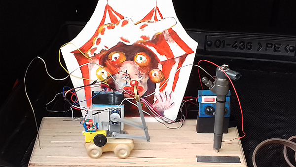

# atTinyThings
small projects for AtTiny Atmel microcontrollers

## DC Engine (german)

a small collection of (german) notes I made regarding small RC engines...

## Mechanical Wave Game

a small game, made as a present;

played by avoiding to touch the bent wiring with a electrode by controling speed, direction of a car and angle of a lever.
The lever carrying a tip electrode ring connected to a buzzer.

+ attiny13
+ model servo
+ model gearbox DC engine
+ L293D engine driver
+ 4017 decade counter
+ some capacitors, 
+ one transistor and 
+ 1 switch, 2 Potentiometers, a buzzer

