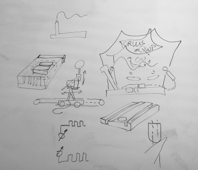

# Design meeting Lunch Break September 2019

we need a present for our colleague .. he leaves our business unit
and we want to honor his work.

Brainstorming brought the idea of a small car , drivinge left to right and vice versa,
with a lever, that carries a electrode. 

Driving and angle of lever have to be controlled manually to not touch bended
wire with a ring at the top of lever.

As he likes to juggle, a juggling clown will be the background.

.

