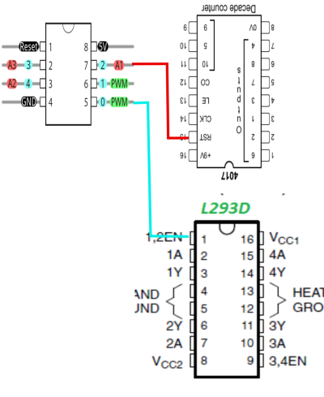
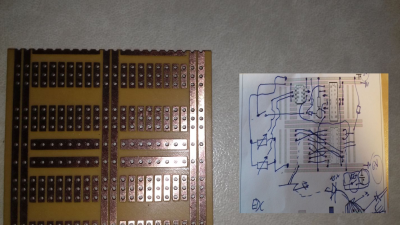
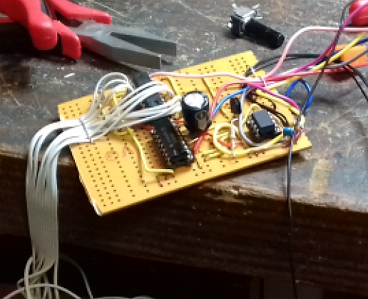
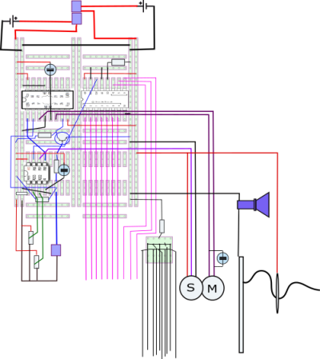

# First Brainstorming physical-electrical-setup:

The electrical muC setup was very fast decided:

attiny13 as a 2 channel AD Converter, 

+ In: Engine speed of car
+ In: Lever Angle
+ Out: Servo Signal for angle servo
+ Out: PWM to control car speed,
+ Out: counter-stepper to create a LED light show 

The translation pulses to lightshow is done via the DecadeCounter 4017

## Layout and Autorouting :-)

The prototype pcb and a small SVG printout allowed for the mighty manual autorouting 
with artificial brain intelligence, paper and pencil:

leading to the first soldered test product: left lower: 4017 decade counter, right lower power ic for engine control, upper right atTiny13 microcontroller.
in the middle, the transistor for the non-muC direct direction reversal at the power ic.

## the finished 'product'

after application of denoising capacitors at the engine, the final build of 
the control unit is shown in all its ugliness :-)

## the final layout

and its professional svg layout:

That's it!
