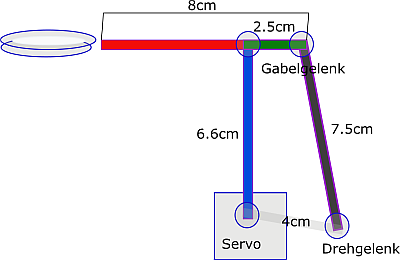
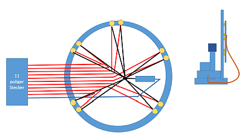
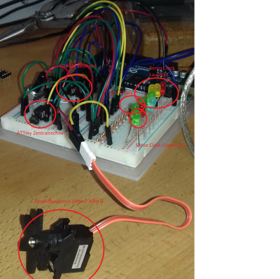
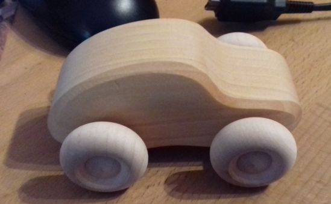
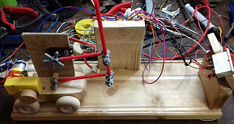
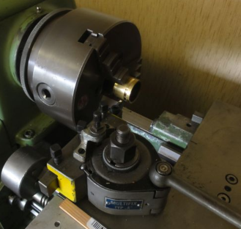
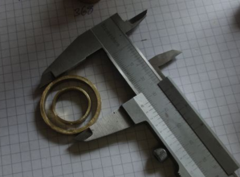
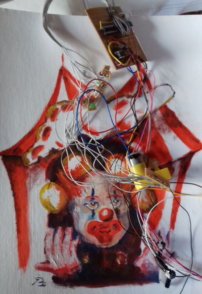
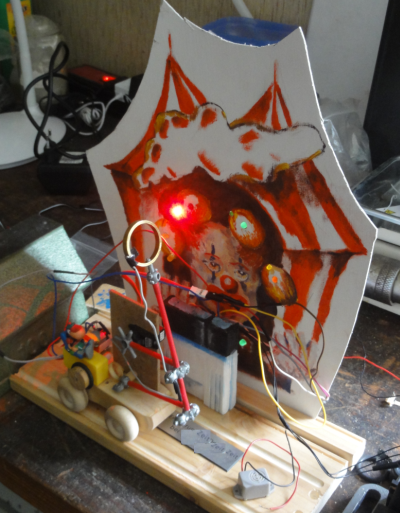

# Mechatronic components

## Lever "Doppelschwinge"

Theorie shows, that if one wnats to transform the rotaton movement of the servo into
a long extended vertical movement, the 
constructors simplets choice could be the (german) Doppelschwinge; 

+ three branches connected by 
+ 3 passiv axles and containig 
+ one driving torque (Servo).

 test bech control board is just a piece of wood, holding the direction switch, and the two potentiometers, and for the short
 prototype board a Control Unit was made out of colored wood.
 If the passive, pulling, branch of the two side branches is a little bit longer than the one connected 
to the servo it ill straighten the lever during it's turning and thus creating a nice linear movement.

## Backgorund Picture

To hint to the juggling hobby we decided to create a clown's picture as background and 
provide the rotating juggling objects with a running light chain of 10 LED's.

## Running LED Chain:

10 wires coming from decade counter, always only one
switched on, thus one backflow wire carries the 
necessary Resistor. Stabilizing concept by old CD.

## arduino atttiny setup to develop software

Arduino is only providing power, as programming is 
done via a mkII compatible ISP Interface to Atmel 
Studio.

## First Mockup:

together with a small wooden car, a bunch of drinking straws, a yellow small gearbox engine,
and glue a first prototype came into play:

## Elektrodes for buzzing error sound

out of brass tubing, two rings were cut by a lathe to serve as elektrodes at the tip of the lever

## Put it all together 

LED's and Oil painting were combined to create juggling clown background

and mounted on a wood shingle, the first functional prototype came into life:

remining issues were to transfer this to a nice plate of wood, replace the lever by a 3d print part, 
and hide the wiring harness in some tubing....

